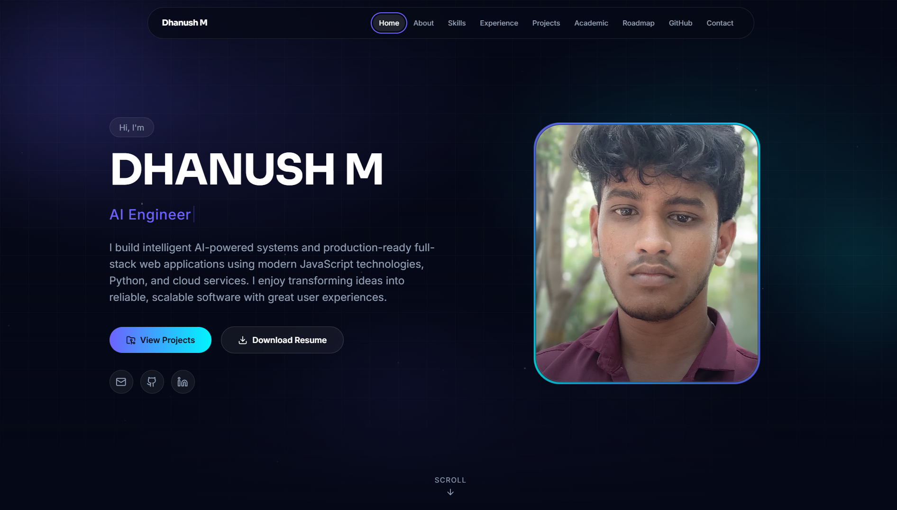

<div align="center">

# 🚀 Dhanush M Portfolio

### AI Engineer • Generative AI • Full Stack Developer

A modern, responsive personal portfolio showcasing my AI projects, software engineering experience, technical skills, and professional journey.

🌐 **Live Website:** https://dhanush-m-dev.vercel.app

[](https://dhanush-m-dev.vercel.app)
[](https://www.linkedin.com/in/dhanush-m-arceus05)
[](https://github.com/DhanushArceus05)

</div>

---

# ✨ Overview

This portfolio serves as my professional digital presence, highlighting my expertise in **Artificial Intelligence, Generative AI, Agentic AI, and Full Stack Development**.

It is designed to provide recruiters, hiring managers, and fellow developers with a clean and interactive way to explore my projects, technical skills, certifications, and professional experience.

---

# 🌟 Features

- 🎨 Modern Responsive UI
- 🌙 Dark Theme Design
- ⚡ Built with React + TypeScript
- 📱 Mobile Friendly
- 🚀 Fast Performance
- 🔍 SEO Optimized
- 🖼️ Open Graph & Social Sharing Support
- 🎯 Professional Branding
- 🧭 Smooth Navigation
- 📬 Contact Section
- 🏆 Project Showcase
- 📄 Resume Integration
- 🔗 LinkedIn & GitHub Integration
- ⭐ Custom DM Branding
- 🎯 Custom Favicon

---

# 🛠 Tech Stack

### Frontend

- React
- TypeScript
- Vite
- Tailwind CSS
- Framer Motion

### Tools

- Git
- GitHub
- Vercel
- VS Code

---

# 📸 Portfolio Preview


---

# 🚀 Live Demo

### 🌐 Portfolio

https://dhanush-m-dev.vercel.app

---

# 📂 Project Structure

```text
src/
 ├── components/
 ├── pages/
 ├── assets/
 ├── hooks/
 ├── utils/
 ├── styles/

public/
 ├── icons/
 ├── images/
 ├── resume/
```

---

# ⚙️ Getting Started

## Clone Repository

```bash
git clone https://github.com/DhanushArceus05/dhanush-m-portfolio.git
```

## Install Dependencies

```bash
npm install
```

## Run Development Server

```bash
npm run dev
```

## Build Production

```bash
npm run build
```

---

# 📄 License

This project is licensed for portfolio and educational purposes.

---

# 👨‍💻 Author

## Dhanush M

AI Engineer • Generative AI • Full Stack Developer

📧 Email

arceusdhanush05@gmail.com

🌐 Portfolio

https://dhanush-m-dev.vercel.app

💼 LinkedIn

https://www.linkedin.com/in/dhanush-m-arceus05

💻 GitHub

https://github.com/DhanushArceus05

---

<div align="center">

### ⭐ If you like this project, consider giving it a Star!

Made with ❤️ by Dhanush M

</div>
